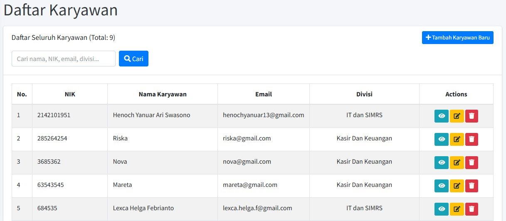

# 🧑‍💻 Daftar Karyawan

Halaman **Daftar Karyawan** adalah *dashboard* manajemen pusat yang hanya dapat diakses oleh Administrator dan staf HRD. Halaman ini digunakan untuk melihat, mencari, menambah, dan mengelola seluruh data karyawan di perusahaan.

## 1. Mengakses Halaman

1.  *Login* menggunakan akun **Administrator** atau **HRD**.
2.  Akses **Menu Administrator**.
3.  Pilih opsi **"Daftar Karyawan"**.

## 2. Fitur Pencarian dan Filter

Halaman ini dilengkapi dengan fitur pencarian cepat untuk mempermudah administrasi:

1.  **Kotak Pencarian:** Anda dapat mengetikkan **Nama Karyawan**, **NIK**, **Email**, atau **Divisi** di kotak pencarian yang tersedia.
2.  **Tombol Cari:** Setelah memasukkan kata kunci, klik tombol **"Cari"** (biru) untuk memfilter daftar.

!!! note "Total Karyawan"
    Di bagian atas halaman, Anda akan melihat total jumlah karyawan yang terdaftar dalam sistem (Contoh: **Total: 10**).

## 3. Menambahkan Karyawan Baru

Untuk meregistrasi karyawan baru ke dalam sistem absensi:

1.  Klik tombol **"+ Tambah Karyawan Baru"** (biru) di pojok kanan atas.
2.  Anda akan diarahkan ke formulir *input* data.
    
3.  Isi semua kolom yang diperlukan (Nama, NIK, Email, Divisi, *Password* awal, dan rekam wajah karyawan yang akan ditambahkan).
4.  Klik **Ambil Foto** dan **"Upload"** untuk menyelesaikan registrasi.

## 4. Tabel Daftar Karyawan dan Tindakan (Actions)

Tabel ini menampilkan ringkasan data penting dan tombol tindakan untuk setiap karyawan:

| Kolom | Keterangan Data |
| :--- | :--- |
| **No.** | Nomor urut karyawan dalam daftar. |
| **NIK** | Nomor Induk Karyawan. |
| **Nama Karyawan** | Nama lengkap karyawan. |
| **Email** | Alamat *email* yang terdaftar. |
| **Divisi** | Divisi tempat karyawan bekerja. |

### Tombol Actions:

| Ikon | Tindakan (Action) | Kegunaan |
| :---: | :--- | :--- |
| :material-eye: | **Lihat Detail** | Melihat informasi detail dan riwayat karyawan (data pribadi, *history* absensi). |
| :material-pencil: | **Edit Data** | Mengubah informasi karyawan (nama, email, divisi, dan status akun). |
| :material-trash-can: | **Hapus Data** | Menghapus data karyawan secara permanen dari sistem (gunakan dengan sangat hati-hati). |

---

### ❓ Manajemen Data

!!! warning "Perhatian"
    * **Bagaimana cara mengubah *password* karyawan?**
        * *Password* karyawan hanya bisa diubah oleh pemilik akun tersebut, Administrator dan HRD tidak diizinkan untuk mengubah password akun karyawan.
    * **Apakah data karyawan yang dihapus bisa dikembalikan?**
        * Tidak. Penghapusan bersifat permanen. Pastikan Anda melakukan *backup* jika diperlukan.

➡️ Lanjutkan ke panduan Admin berikutnya: [Data Presensi Karyawan](../admins/presensi-karyawan.md)