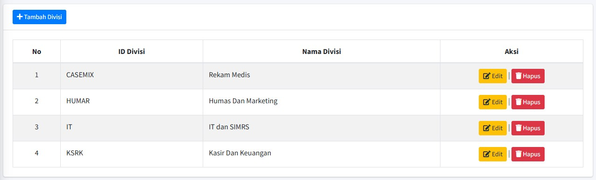

# 🏢 Master Divisi

Halaman **Master Divisi** digunakan oleh Administrator sistem untuk mengelola semua unit atau divisi yang ada dalam struktur perusahaan. Data ini sangat penting karena digunakan untuk *mapping* jadwal, pemfilteran laporan, dan penugasan karyawan.

## 1. Cara Mengakses Halaman

1.  *Login* menggunakan akun **Administrator**.
2.  Akses **Master Data**.
3.  Pilih opsi **"Master Divisi"**.

## 2. Tabel Daftar Divisi

Tabel utama menampilkan daftar divisi yang telah terdaftar dalam sistem:

| Kolom | Keterangan Data |
| :--- | :--- |
| **No** | Nomor urut daftar. |
| **ID Divisi** | Kode unik divisi (Contoh: **CASEMIX**, **HUMAR**, **IT**). |
| **Nama Divisi** | Nama lengkap divisi (Contoh: **Rekam Medis**, **Humas Dan Marketing**, **IT dan SIMRS**). |
| **Aksi** | Tombol untuk mengelola data divisi. |

## 3. Menambahkan Divisi Baru

Untuk mendaftarkan divisi baru:

1.  Klik tombol **"+ Tambah Divisi"** (biru) di pojok kiri atas halaman.
2.  Isi formulir yang muncul:
    * **ID Divisi:** Masukkan kode singkat unik (misalnya, **HRD**).
    * **Nama Divisi:** Masukkan nama lengkap (misalnya, **Human Resources Development**).
3.  Klik **"Submit"** untuk menambahkan divisi ke dalam sistem.

## 4. Mengelola Data Divisi (Aksi)

Kolom **Aksi** pada tabel memungkinkan Anda untuk memelihara data divisi yang sudah ada:

| Tombol | Tindakan (Aksi) | Kegunaan |
| :---: | :--- | :--- |
| :material-pencil: | **Edit** (Kuning) | Mengubah **Nama Divisi**. Setelah diedit, klik **"Submit"** untuk memperbarui. |
| :material-trash-can: | **Hapus** (Merah) | Menghapus data divisi secara permanen dari sistem. |

!!! warning "Perhatian Sebelum Menghapus"
    Sebelum menghapus sebuah divisi, pastikan **tidak ada karyawan yang masih terdaftar** di divisi tersebut. Menghapus divisi yang masih memiliki karyawan terikat dapat menyebabkan kesalahan pada *mapping* jadwal dan laporan presensi.

---

### ❓ Integrasi Data

Data divisi yang Anda kelola di halaman ini akan digunakan di fitur-fitur lain, seperti:

1.  **Daftar Karyawan:** Saat Anda menambah karyawan baru, mereka harus ditugaskan ke salah satu divisi yang terdaftar di sini.
2.  **Laporan Presensi:** Data divisi digunakan sebagai filter utama untuk [melihat laporan presensi karyawan](../presensi-karyawan.md).

➡️ Lanjutkan ke panduan Admin berikutnya: [Master Jadwal](../master-data/jadwal.md)