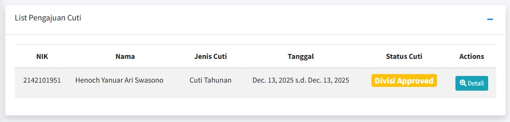
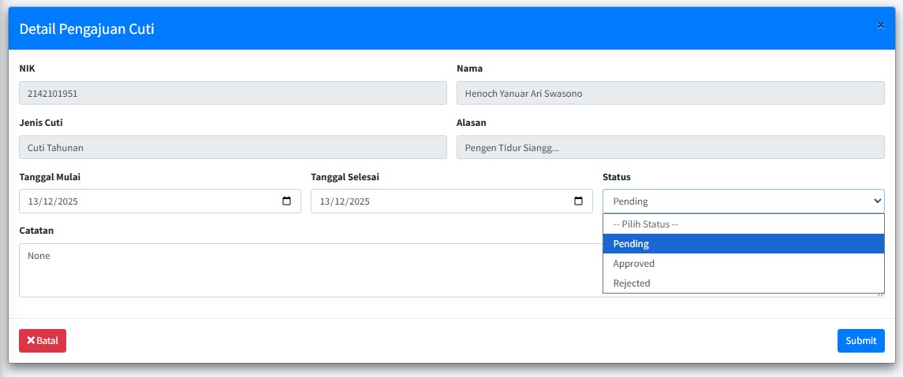

# ⚙️ Panduan Approval Pengajuan Cuti (Untuk HRD)

Halaman **"Approval Pengajuan Cuti"** adalah *dashboard* khusus yang ditujukan bagi penanggung jawab divisi atau HRD untuk meninjau, menyetujui, atau menolak permintaan cuti yang diajukan oleh karyawan di bawah pengawasan mereka.

## 1. Cara Mengakses Halaman

1.  *Login* sebagai **Penanggung Jawab/Administrator**.
2.  Pilih menu **"Persetujuan Cuti"**.
3.  Anda akan dialhikan ke halaman daftar pengajuan cuti karyawan dari semua divisi.

## 2. Membaca Daftar Antrian Pengajuan

Pada bagian **"Persetujau Cuti"**, Anda akan melihat daftar permintaan cuti yang perlu ditinjau, yang mencakup informasi berikut:

| Kolom | Keterangan |
| :--- | :--- |
| **NIK** | Nomor Induk Karyawan yang mengajukan cuti. |
| **Nama** | Nama Karyawan yang mengajukan. |
| **Jenis Cuti** | Jenis cuti yang diajukan. |
| **Tanggal** | Periode cuti yang diajukan. |
| **Status Cuti** | Status terakhir pengajuan tersebut. |
| **Actions** | Tombol untuk mengambil tindakan. |

## 3. Proses Persetujuan (Approval)

Ketika ada pengajuan baru (Status **Divisi Approved**), Anda harus meninjau dan mengambil tindakan:

* **Lihat Detail:** Untuk meninjau pengajuan, klik tombol **"Detail"** di kolom Actions. Anda akan dialihkan ke halaman detail:

* **Untuk Menyetujui** Pilih **"Approved"** pada *dropdown* status, sesuaikan tanggal cuti yang Anda setujui, dan berikan **Catatan** seperlunya saja. Status akan berubah menjadi **Approved** (Biru).
* **Untuk Menolak:** Pilih **"Rejected"** pada *dropdown* status, berikan **Catatan** yang menjelaskan alasan penolakan. Status akan berubah menjadi **Rejected** (Merah).

<!-- !!! success "Contoh Approved"
    Pengajuan cuti **Henoch Yanuar Ari Swasono** pada **Dec. 10 s.d. Dec. 11, 2025** menunjukkan Status **Approved**.

!!! danger "Contoh Rejected"
    Pengajuan cuti **Henoch Yanuar Ari Swasono** pada **Dec. 24 s.d. Dec. 25, 2025** menunjukkan Status **Rejected**. -->

## 4. Dampak Persetujuan pada Sistem

| Keputusan Anda | Dampak pada Karyawan | Referensi Data |
| :--- | :--- | :--- |
| **Approved** | Tanggal cuti otomatis tercatat di **Riwayat Absensi** karyawan sebagai **Cuti**. | Karyawan akan melihat status **Cuti** di Riwayat Absensi mereka. |
| **Rejected** | Karyawan diwajibkan bekerja pada tanggal yang diajukan. | Status **Rejected** muncul di halaman **Pengajuan Cuti** karyawan. |

---

### ❓ Pertanyaan yang Sering Diajukan oleh Admin

!!! warning "Perhatian"
    * **Bagaimana jika saya salah *Approve*?**
        * Pembatalan *Approval* harus dilakukan melalui Administrator Level Atas (IT). Segera hubungi tim teknis jika terjadi kesalahan.
