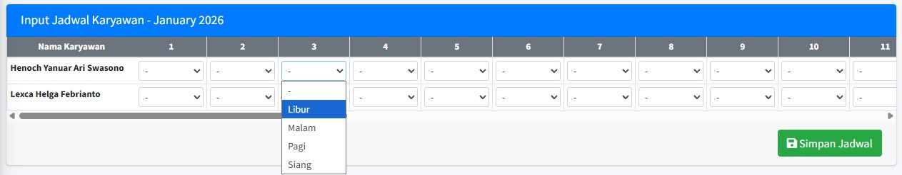
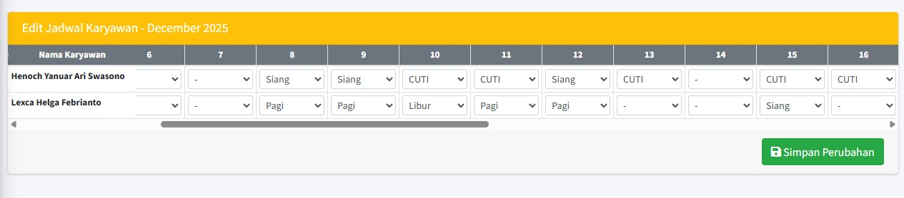

# 🗓️ Mapping dan Penugasan Jadwal Karyawan

Halaman **Mapping Jadwal Karyawan** adalah fitur khusus yang hanya dapat diakses oleh Penanggung Jawab Divisi atau Administrator HRD. Fitur ini digunakan untuk menetapkan dan mengelola jadwal *shift* harian untuk setiap karyawan di bawah divisi yang bersangkutan selama periode dua bulan (bulan ini dan bulan depan).

### 1. Hak Akses dan Tampilan

* Ketika Penanggung Jawab Divisi *login*, sistem secara otomatis akan memfilter dan hanya menampilkan data untuk divisi yang mereka kelola (Contoh: **Divisi: IT**).
* Tampilan utama adalah tabel kalender yang menunjukkan tanggal (**1** hingga **31**) sebagai kolom dan nama karyawan sebagai baris.

### 2. Membaca Informasi Jadwal

Tabel *mapping* ini memberikan ringkasan jadwal secara cepat:

| Kolom | Keterangan |
| :--- | :--- |
| **Divisi** | Divisi yang sedang Anda kelola (Contoh: **Divisi: IT**). |
| **Periode** | Bulan dan Tahun yang sedang aktif (Contoh: **December 2025**). |
| **NIK & Nama Karyawan** | Daftar karyawan yang berada di bawah divisi tersebut (Contoh: **Henoch Yanuar Ari Swasono** dan **Lexca Helga Febrianto**). |
| **Kolom Tanggal (1, 2, 3, ...)** | Isi sel menunjukkan nama *shift* atau status non-kerja pada tanggal tersebut (Contoh: **Siang**, **Pagi**, **Cuti**, **Libur**). |

### 3. Panduan Pembuatan Jadwal

Untuk membuat jadwal karyawan:

1.  **Akses Mode Tambah:** Klik tombol **"Buat Jadwal"** (berwarna biru) yang terletak di pojok kiri atas tabel.
2.  **Membuat Jadwal:**
    * Muncul *popup* yang meminta Anda untuk menginputkan **tanggal**, **tahun**, dan **divisi** Anda, seperti berikut:

        

    * Selanjutnya Anda akan dialihkan ke halaman penginputan jadwal, dengan memilih *shift* untuk semua karyawan di setiap tanggal

        

3.  **Menyimpan Perubahan:** Setelah selesai menginputkan seluruh jadwal, klik tombol **"Simpan Jadwal"** untuk menerapkan jadwal.

### 4. Panduan Pengeditan Jadwal

Untuk menetapkan atau mengubah jadwal karyawan:

1.  **Akses Mode Edit:** Klik tombol **"Edit"** (berwarna kuning) yang terletak di pojok kanan bawah tabel.

    

2.  **Mengisi Jadwal:**
    * Klik pada sel tanggal karyawan yang ingin Anda *mapping*.
    * Masukkan kode *shift* yang berlaku (Contoh: ketik **"Pagi"**, **"Siang"**, **"Libur"**).
    * **Catatan Cuti:** Status seperti **"Cuti"** terisi secara otomatis oleh sistem setelah pengajuan cuti/izin karyawan tersebut disetujui (Status **Approved**) di halaman **Approval Pengajuan Cuti**. **Status cuti tidak bisa diedit.**
3.  **Menyimpan Perubahan:** Setelah selesai mengedit seluruh jadwal, klik tombol **"Simpan  Perubahan"** untuk menerapkan perubahan.

!!! warning "Sinkronisasi Jadwal"
    Perubahan jadwal yang Anda simpan akan segera tersinkronisasi ke aplikasi *mobile* karyawan. Harap pastikan jadwal yang diinput sudah final, karena ini akan mempengaruhi status **Tepat Waktu** atau **Terlambat** saat karyawan melakukan absensi.

<!-- ### 4. Navigasi Jadwal (Bulan Berikutnya/Sebelumnya)

Anda dapat menavigasi ke periode jadwal lain untuk melakukan *mapping* di awal bulan:

* Gunakan tombol panah atau *dropdown* yang ada di sekitar **Periode** (**December 2025**) untuk memilih bulan yang berbeda. -->

---

### ❓ Dampak pada Aplikasi Karyawan

Setelah jadwal di-*mapping* di halaman ini:

1.  Karyawan dapat melihat jadwal yang Anda tentukan di halaman **Jadwal Bulanan** mereka.
2.  Sistem akan menggunakan jam *shift* yang Anda tentukan (misalnya, *Shift* Pagi) sebagai patokan waktu untuk menghitung status **Tepat Waktu** atau **Terlambat** pada saat karyawan melakukan Absen Masuk.

➡️ Lanjutkan ke panduan Admin: [Approval Pengajuan Cuti](../divisions/setujui-cuti.md)