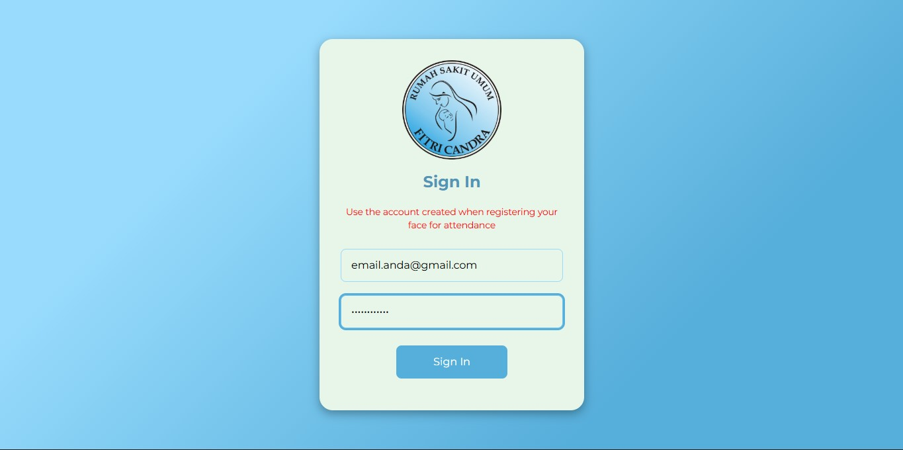

# 🔐 Panduan Login ke Aplikasi ASI DEWA

Panduan ini menjelaskan langkah-langkah yang diperlukan untuk mengakses akun Anda di Aplikasi Aplikasi Absensi Deteksi Wajah (ASI DEWA) untuk pertama kalinya dan untuk penggunaan harian.

## Prasyarat

Sebelum mencoba *login*, pastikan hal-hal berikut telah terpenuhi:

* Anda sudah pernah merekam data anda ke administrator (IT).
* Anda telah menginputkan **Email** dan masih ingat **Password** yang anda cantumkan pertama kali saat perekaman data.

---

## Langkah 1: Membuka Aplikasi

1.  Akses aplikasi **ASI DEWA** pada *browser* anda [link](https://192.168.88.20/admins/login).
2.  Klik url tersebut untuk membuka aplikasi.

!!! warning "Perhatian"
    Pastikan perangkat Anda terhubung dengan jaringan internet Rumah Sakit.

## Langkah 2: Melakukan Login

Anda akan diarahkan ke halaman *Login*.

1.  Masukkan **Email** dan **Password** yang sudah anda daftarkan, di kolom input yang sudah disediakan.
2.  Tekan tombol **"Sign In"** di bagian bawah layar.
3.  Jika **Email** dan **Password** benar, Anda akan diarahkan ke halaman *Jadwal* untuk akun karyawan, *Mapping Jadwal* untuk akun P.J. Divisi, dan *Dashboard* untuk akun HRD atau superadmin.

---

## ⚠️ Jika Gagal Login (Troubleshooting)

| Masalah | Solusi |
| :--- | :--- |
| **"Username atau Password Salah"** | Periksa kembali pengetikan Anda (perhatikan huruf besar/kecil). Coba masukkan ulang password Anda dengan hati-hati. |
| **Lupa Password** | Hubungi administrator (IT) 😭 untuk penyetelan ulang pasword |
| **Tidak Ada Koneksi Internet** | Pastikan Anda terhubung ke internet. Aplikasi memerlukan koneksi untuk memvalidasi *login*. |

---

Anda kini telah berhasil *login* dan siap menggunakan fitur absensi! Lanjutkan ke [Cara Absen Masuk Harian](../panduan-pengguna/absen-masuk.md).