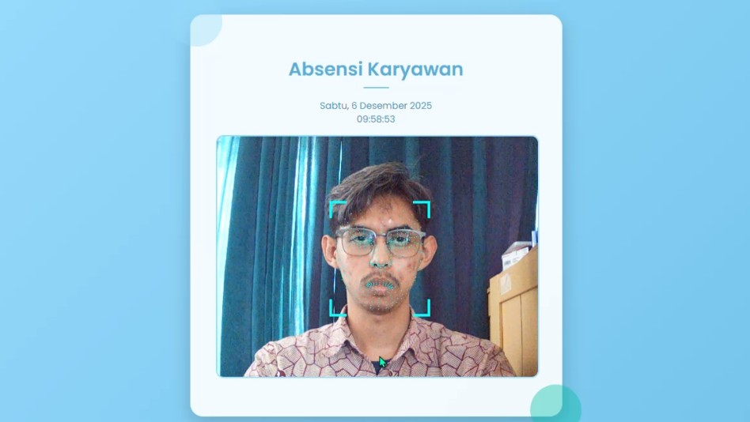

# Cara Absen Masuk Harian

Panduan ini akan memandu Anda dalam melakukan Absensi Masuk saat memulai hari kerja.

## Langkah 1: Akses Menu Utama

Buka aplikasi ASI DEWA atau kunjungi pusat absensi yang sudah disediakan.

Tekan tombol **"START"** di navigasi bawah, untuk memulai penginputan absensi.

!!! note "Pastikan Internet"
    Pastikan internet terkoneksi pada jaringan rumah sakit.

## Langkah 2: Ambil Foto

Aplikasi akan mengarahkan Anda ke menu absen, dan membuka kamera komputer.   

1.  Tunggu hingga sistem berhasil mendeteksi posisi wajah Anda, dengan terdapat *landmark* atau titik-titik di wajah Anda pada layar.

2.  Setelah terdapat *landmark* pada wajah Anda, kedipkan mata untuk pengambilan gambar.
3.  Jika absen berhasil, Anda akan melihat *popup* dengan informasi data diri dan data absen anda.

!!! warning "Perhatian"
    1.  Pastikan wajah Anda tidak tertutup dan tidak terhalangi apapun termasuk **masker** dan **kacamata hitam**.
    2.  Jika Anda menggunakan kacamata minus atau sejenisnya (lensa tidak berwarna), pastikan tidak ada **pantulan cahaya** *(glare)* dari lensa kacamata anda.

## Langkah 3: Konfirmasi

Setelah foto berhasil diambil, periksa **data diri**, **waktu**, dan **status absensi**. Pastikan semua data sesuai.

Tekan tombol **"OK"** untuk menyelesaikan proses.
Anda sudah berhasil absen masuk !!. Lanjutkan ke [Cara Absen Pulang Harian](../panduan-pengguna/absen-pulang.md).